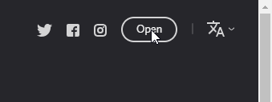
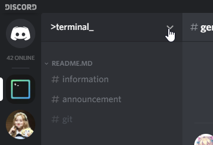

All _too common_, a person will try to invite a bot,
and they can't see the server they are trying to invite.  

If you see the following screen, and the server you want to invite a bot to isn't available,
you can try to debug why this is not occurring, by following some simple steps.  

## Insight 1 - You are logged in to the wrong account
You may be logged into Discord on the incorrect Discord account in your web browser.
This is common with users who have multiple Discord accounts,
or has someone else logging into Discord using the web browser.

### How to fix
1. Go to https://discordapp.com/
2. Click `Open` button, located in the top right hand corner of the screen  
   
3. After waiting for Discord to load in your **web browser**,
   click on the **cog** on the bottom left hand corner of the screen.  
   
4. On the bottom left hand corner of the screen, click the `Log Out` button to log off.  
   
5. Click `Log Out` again to confirm your selection.  
6. Click `Login`, located in the top right hand corner of the screen  
   
7. Refresh the "Connect to Discord" page.

If your servers are back, you can now invite your bot normally.
If not, make sure you are on the right account.
Try alternative accounts that may be able to invite the bot.

## Insight 2 - You may not even have the right permissions
Just because someone gave you the "Moderator" role in a server,
doesn't mean you have permission to invite any bots.

### How to fix
To be able to invite bots, your server administrator must give you the `Manage Server` permission.
Please contact your administrator for this permission.

If you are the administrator:

1. Find the name of the role that your administrators have.
   In this example, administrators in the `Terminal.ink` server have the `ohlookitsveld` role.
2. Click on the drop down arrow on the top left corner of the Discord window  
   
3. Click on Server Settings  
   
4. Click on the Roles tab  
   
5. Find the correct role, and toggle the `Manage Server` permission
   
6. Save changes when you are finished
   

## Conclusion
After following all steps, you should be able to invite a bot to your server.

If, after following all steps, you fail to invite a bot,
please try and contact the technical support for the bot you are trying to invite,
or join [our Discord server]({{site.data.strings.discord}}) for one on one help.
